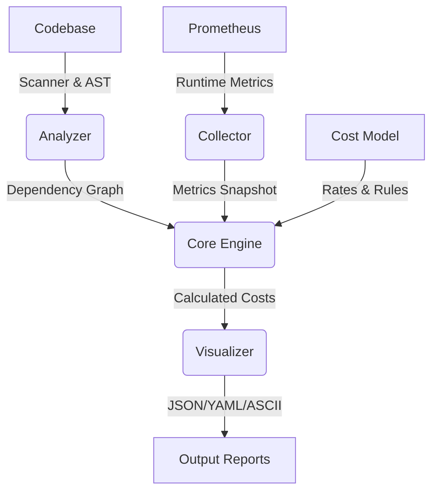

# MicroCost System Architecture

This document details the internal design and data flow of **MicroCost**. It explains how the static analysis, metrics collection, and cost calculation engines work together to produce cost reports.

## 🏗️ High-Level Architecture

MicroCost operates as a linear pipeline with four distinct stages:



## 🧩 Core Components

### 1. Analyzer (`internal/analyzer`)
**Goal:** Build a static map of microservices and their dependencies.

*   **Scanner (`scanner.go`)**: 
    *   Recursively walks the directory tree.
    *   Uses Go's `go/parser` and `go/ast` to parse source code.
    *   Identifies potential services based on directory structure or configuration patterns.
*   **Detectors (`http_detector.go`, `grpc_detector.go`)**:
    *   Inspect `ast.FuncDecl` nodes to find HTTP client calls and gRPC method invocations.
    *   Extracts target URLs (e.g., `http://payment-service:8080/charge`).
*   **Graph Builder (`graph_builder.go`)**:
    *   Orchestrates the scanning process.
    *   Converts raw AST data into the internal `CallGraph` model.

### 2. Graph Engine (`internal/graph`)
**Goal:** Represent services as a Directed Acyclic Graph (DAG) for traversal.

*   **Graph (`graph.go`)**:
    *   Implements a generic graph data structure.
    *   Nodes = Services (`Node`).
    *   Edges = Dependencies (`Edge`).
    *   Provides algorithms for **Topological Sort** (critical for cost attribution order) and **Cycle Detection**.

### 3. Collector (`internal/collector`)
**Goal:** Gather runtime usage data to weight the static graph.

*   **Prometheus Collector (`prometheus.go`)**:
    *   Connects to a Prometheus instance.
    *   Queries key metrics over a time window:
        *   `rate(http_requests_total)`: Request volume.
        *   `container_cpu_usage_seconds_total`: CPU consumption.
        *   `container_memory_usage_bytes`: RAM usage.
        *   `http_request_duration_seconds`: Network latency.
    *   Maps Prometheus labels (e.g., `app="product-service"`) to static Service names.

### 4. Cost Engine (`internal/costengine`)
**Goal:** Calculate attributed costs.

*   **Calculator (`calculator.go`)**:
    *   The brain of the system.
    *   **Direct Cost**: `(CPU * Rate) + (RAM * Rate) + (Network * Rate)`.
    *   **Attributed Cost**: The share of downstream service costs that upstream services are responsible for.
    *   **Logic**:
        1.  Sort services topologically (Leaf nodes first, e.g., `Pricing Service`).
        2.  Calculate direct cost for the leaf.
        3.  Propagate cost upwards to parents (e.g., `Product Service`) based on traffic weight.
        4.  Parents sum their direct cost + attributed downstream cost.

### 5. Visualizer (`internal/visualizer`)
**Goal:** Present data to the user.

*   **Exporter (`export.go`)**: Serializes internal models to JSON/YAML files.
*   **ASCII Renderer (`ascii.go`)**: Generates the terminal UI, including trees and color-coded tables.

## 🔄 Data Movement

### Step 1: `analyze` Command
1.  **Config**: Reads `analysis.paths` from `config.yaml`.
2.  **Action**: `Scanner` looks for Go files. `AST` detects `http.Get("...")`.
3.  **Result**: `CallGraph` object (Service A -> Service B).

### Step 2: `collect` Command
1.  **Input**: Takes the `CallGraph`.
2.  **Action**: Queries Prometheus for `Service A` metrics.
3.  **Result**: `MetricsSnapshot` (Service A: 50 req/sec, 200MB RAM).

### Step 3: `calculate` Command
1.  **Input**: `CallGraph` + `MetricsSnapshot` + `CostModel` (AWS/GCP rates).
2.  **Action**:
    *   `Pricing Service` Cost = $10 (Direct).
    *   `Product Service` calls `Pricing` (100% of traffic).
    *   `Product Service` Cost = $20 (Direct) + $10 (Attributed) = $30.
3.  **Result**: `CostReport`.

## 📂 Directory Structure Map

```text
├── cmd/                # Entry points (Cobra commands)
│   ├── root.go         # Global flags & config loading
│   ├── analyze.go      # 'analyze' command logic
│   └── ...
├── internal/
│   ├── analyzer/       # Static code analysis (AST)
│   ├── collector/      # Prometheus integration
│   ├── costengine/     # Financial logic
│   ├── graph/          # DAG data structures
│   └── visualizer/     # Output formatting
├── pkg/
│   ├── config/         # Viper configuration
│   └── models/         # Shared structs (Service, CostReport)
└── main.go             # Binary entry point
```
